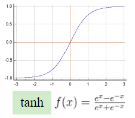
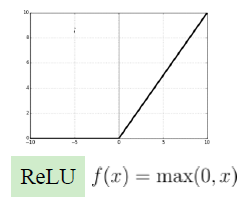

- [Chapter 6: Multilayer Neural Networks](#chapter-6-multilayer-neural-networks)
  - [6.1 Artificial Neural Networks (ANN)](#61-artificial-neural-networks-ann)
    - [6.1.1 The M-P neuron model](#611-the-m-p-neuron-model)
    - [6.1.2 Feedforward Neural Network](#612-feedforward-neural-network)
    - [6.1.3 Expressive power of ANN](#613-expressive-power-of-ann)
    - [6.1.4 Activation function](#614-activation-function)
  - [6.2 Backpropagation algorithm](#62-backpropagation-algorithm)
    - [6.2.1 Criterion function](#621-criterion-function)
    - [6.2.2 Backpropagation procedure](#622-backpropagation-procedure)
    - [6.2.3 training protocol](#623-training-protocol)
      - [6.2.3.1 Stochastic training](#6231-stochastic-training)
      - [6.2.3.2 Batch training](#6232-batch-training)

# Chapter 6: Multilayer Neural Networks
## 6.1 Artificial Neural Networks (ANN)

Artificial Neural Networks (ANN) are **massively parallel interconnected networks of simple (usually adaptive) elements and their hierarchical organization** which are intended to interact with the objects of the real world in the same way as biological nervous systems do.

### 6.1.1 The M-P neuron model

The M-P neuron receives input signals from `n` other neurons and conveys them through weighted connections.

The total input value received by the M-P neuron will be compared with the neuron's threshold, and then processed by the **Activation Function** to produce the neuron's output.

- **Input**: $x_i \, (1 \leq i \leq n)$
- **Weight**: $w_i \, (1 \leq i \leq n)$
- **Bias/Threshold**: $\theta$
- **Activation Function**: $f(\cdot)$
- **Output**: $y = f(\sum\limits_{i=1}^n w_i x_i - \theta)$
- **One mathematical understanding**:
  - The output of the M-P neuron is the function of $x_1, x_2, \dots, x_m$, then we have (**First-order Taylor function approximation**):
    $$
    \begin{align}
        y&=f(x_1,x_2,...,x_m) \nonumber\\
        &\approx f(0,0,...,0)+\sum\limits_{i=1}^N[\frac{\partial f}{\partial x_i}|(0,0,...,0)]x_i+...\nonumber\\
        &=\sum\limits_{i=1}^mw_ix_i+b \nonumber
    \end{align}
    $$ 

---

**The XOR Problem**: 

$$
\begin{aligned}
&\text{Decide } +1 \text{ if } x_1 \cdot x_2 = 1\\
&\text{Decide } -1 \text{ if } x_1 \cdot x_2 = -1\\
\end{aligned}
\quad \Longrightarrow \text{Linear Inseparable}
$$

We cannot use a **single** M-P neuron to solve a linear inseparable problem.

**One possible solution**:

This is a $2$-$2$-$1$ three-layer ANN ($d = 2, n_H = 2$): 
- **Inpute to the hidden unit**: $\text{net}_j = \sum\limits_{i=1}^d w_{ji} x_i + w_{j0} = w_j^t x$
- **Activation of the hidden unit**: $y_j = f(\text{net}_j); f(\text{net}) = \text{Sgn}(net) = \begin{cases}1 \quad &\text{if net} \ge 0 \\ -1 \quad &\text{if net} \le 0\end{cases}$
- **Input to the output unit**: $\text{net}_k = \sum\limits_{j=1}^{n_H} w_{kj}y_j + w_{k0} = w_k^t y$
- **Activation of the output unit**: $z_k = f(\text{net}_k)$

### 6.1.2 Feedforward Neural Network

**Settings** (A $d$-$n_H$-$c$ fully connected three-layer network)
- **Featurs**: $d$
- **Hidden neurons**: $n_H$
- **Output neurons**: $c$
- **Training pattern**: $x = (x_1, x_2, \dots, x_d)^t$
- **Desired output**: $t = (t_1, t_2, \dots, t_c)^t$

**Parameters to be learned**:
- **Input-to-hidden** layer weight (i-th feature to j-th hidden unit): $w_{ji}$
- **Hidden-to-output** layer weight (j-th hidden unit to k-th output unit): $w_{kj} \quad (1 \le i \le d); (1 \le j \le n_H); (1 \le k \le c);$
- total $n_H \cdot (d + c)$ parameters in $w$: $w = (w_{11}, \dots, w_{n_H d}, \dots, w_{cn_H})^t$

**Feedforward procedure**: 
- $\text{net}_j = \sum\limits_{i = 1}^d w_{ji}x_i \quad(1 \le j \le n_H)$
- $y_j = f(\text{net}_j) \quad (1 \le j \le n_H)$
- $\text{net}_k = \sum\limits_{j = 1}^{n_H} w_{kj}y_j \quad (1 \le k \le c)$
- $z_k = f(\text{net}_k) \quad (1 \le k \le c)$
- **Discriminant function**: $g_k = z_k = f(\sum\limits_{j=1}^{n_H} w_{kj} f(\sum\limits_{i=1}^d w_{ji}x_i))$

### 6.1.3 Expressive power of ANN
One layer of hidden units with **sigmoid activation function (a step function)** is sufficient for
approximating any function with finitely many discontinuities to arbitrary precision

### 6.1.4 Activation function

  
  
  

1. **Sigmoid**: $f(x) = \frac{1}{1 + e^{-x}}$ 
2. **tanh**: $f(x) = \frac{e^x - e^{-x}}{e^x + e^{-x}}$
3. **ReLU**: $f(x) = \max(0,x)$

## 6.2 Backpropagation algorithm

**Settings** (A $d$-$n_H$-$c$ fully connected three-layer network)
- **Featurs**: $d$
- **Hidden neurons**: $n_H$
- **Output neurons**: $c$
- **Weights**: $w$
- **Training pattern**: $x = (x_1, x_2, \dots, x_d)^t$
- **Desired output**: $t = (t_1, t_2, \dots, t_c)^t$

### 6.2.1 Criterion function
We set the **Criterion function** as

$$
J(w) = \frac{1}{2} \sum\limits_{k=1}^c (t_k - z_k)^2 = \frac{1}{2} ||t - z||^2
$$

**Gradient descent**:

$$
\begin{aligned}
w \leftarrow &w + \Delta w \\
&\Delta w = -\eta \frac{\partial J}{\partial w} \; \big(\Delta w_{pq} = - \eta \frac{\partial J}{\partial w_{pq}} \big)\\
\end{aligned}
$$

- for **hidden-to-output** layer weight (j-th hidden unit to k-th output unit): $w_{kj}$
  - **Activation function**:
    - **Sigmoid**: $f^{'} = f \cdot (1 - f)$
    - **tanh**: $f^{'} = 1 - f^2$

$$
\begin{aligned}
\frac{\partial J}{\partial w_{kj}} &= \frac{\partial J}{\partial \text{net}_k} \frac{\partial \text{net}_k}{\partial w_{kj}} = \frac{\partial J}{\partial \text{net}_k} \frac{\sum\limits_{j = 1}^{n_H} w_{kj}y_j }{\partial w_{ki}} = -\textcolor{red}{\delta_k} y_j \\
\textcolor{red}{\delta_k} &= - \frac{\partial J}{\partial \text{net}_k} = - \frac{\partial J}{\partial z_k} \cdot \frac{\partial z_k}{\partial \text{net}_k} \\
&= - \frac{\partial (\frac{1}{2}\sum\limits_{k=1}^c(t_k-z_k)^2)}{\partial z_k} \frac{f(\text{net}_k)}{\partial \text{net}_k}  = (t_k - z_k) f^{'}(\text{net}_k)\\
\textcolor{red}{\Delta w_{kj}} & = -\eta \frac{\partial J}{\partial w_{kj}}= \eta \delta_k y_j = \textcolor{red}{\eta (t_k - z_k) f^{'}(\text{net}_k) y_j}\\
\end{aligned} 
$$

- for **input-to-hidden** layer weight (i-th feature to j-th hidden unit): $w_{ji}$

$$
\begin{aligned}
\frac{\partial J}{\partial w_{ji}} &= \frac{\partial J}{\partial y_j} \frac{\partial y_j}{\partial \text{net}_j} \frac{\partial \text{net}_j}{\partial w_{ji}} = \frac{\partial J}{\partial y_j} \frac{\partial y_j}{\partial \text{net}_j} \frac{\partial (\sum\limits_{i=1}^d w_{ji}x_i)}{\partial w_{ji}} \\
&= \textcolor{red}{\frac{\partial J}{\partial y_j} f'(\text{net}_j)} x_i 
= -\textcolor{red}{\delta_j} x_i \\
\textcolor{red}{\frac{\partial J}{\partial y_j}} &= \frac{\partial}{\partial y_j} \left[\frac{1}{2} \sum_{k=1}^c (t_k - z_k)^2 \right] 
= -\sum_{k=1}^c (t_k - z_k) \frac{\partial z_k}{\partial y_j} \\
& = -\sum\limits_{k=1}^c (t_k - z_k) \frac{\partial z_k}{\partial\text{net}_k} \frac{\partial\text{net}_k}{\partial y_j} \\
&= -\sum_{k=1}^c (t_k - z_k) f'(\text{net}_k) w_{kj} 
= -\sum_{k=1}^c w_{kj} \delta_k, \\
\textcolor{red}{\Delta w_{ji}} &= -\eta \frac{\partial J}{\partial w_{ji}} 
= \eta \delta_j x_i 
= -\eta \frac{\partial J}{\partial y_j} f'(\text{net}_j) x_i 
= \textcolor{red}{\eta \left[ \sum_{k=1}^c w_{kj} \delta_k \right] f'(\text{net}_j) x_i}
\end{aligned}
$$

### 6.2.2 Backpropagation procedure

- $\delta_k, \delta_j$: neuron unit's **sensitivity**

$$
\begin{aligned}
&\textcolor{Blue}{\text{Forward procedure}} \\
&\text{net}_j = \sum\limits_{i = 1}^d w_{ji}x_i \quad(1 \le j \le n_H) \\
&y_j = f(\text{net}_j) \quad (1 \le j \le n_H) \\
&\text{net}_k = \sum\limits_{j = 1}^{n_H} w_{kj}y_j \quad (1 \le k \le c) \\
&z_k = f(\text{net}_k) \quad (1 \le k \le c) \\
\end{aligned}
\quad \Longrightarrow \quad
\begin{aligned}
&\textcolor{Blue}{\text{Backpropagation procedure}} \\
&\delta_k = (t_k - z_k) f^{'}(\text{net}_k) \quad (1 \le k \le c)\\
&\delta_j = f^{'}(\text{net}_j) \sum_{k=1}^c w_{kj} \delta_k \quad (1 \le j \le n_H) \\
\end{aligned}
$$

### 6.2.3 training protocol
#### 6.2.3.1 Stochastic training
- **Stochastic training**:
  - One pattern is randomly selected from the training set, and the weights are updated by presenting the chosen pattern to the network.
- **Stochastic backpropagation**:
    $$
    \begin{aligned}
    &(1) \,\textbf{Begin initialize } n_H, \mathbf{w}, \text{criterion } \theta, \eta, m \gets 0 \\
    &(2) \,\qquad \textbf{do } m \gets m + 1 \\
    &(3) \,\qquad \qquad \mathbf{x}^m \gets \text{randomly chosen training pattern} \\
    &(4) \,\qquad \qquad \text{Invoke the forward and backpropagation procedures on } \mathbf{x}^m \\
    &\qquad \qquad \qquad \text{to obtain } \delta_k \, (1 \leq k \leq c), y_j \text{ and }\delta_j \, (1 \leq j \leq n_H)\\
    &(5) \,\qquad \qquad w_{ji} \gets w_{ji} + \eta \delta_j x_i; \; w_{kj} \gets w_{kj} + \eta \delta_k y_j \\
    &(6) \,\qquad \qquad \textbf{until } \|\nabla J(\mathbf{w})\| \leq \theta \\
    &(7) \quad \textbf{return } \mathbf{w} \\
    &(8) \, \textbf{end} \\
    \end{aligned}
$$

#### 6.2.3.2 Batch training
- **Batch training**:
  - All patterns in the training set are presented to the network at once, and the weights are updated in **one epoch**
- **Settings** (A $d$-$n_H$-$c$ fully connected three-layer network)
  - **Featurs**: $d$
  - **Hidden neurons**: $n_H$
  - **Output neurons**: $c$
  - **Weights**: $w$
  - **Training set consisting $n$ patterns**: $\mathcal{D} = \left\{(x^m, t^m) | 1 \le m \le n \right\}$
  - **Training pattern**: $x^m = (x_1, x_2, \dots, x_d)^t$
  - **Desired output**: $t^m = (t_1, t_2, \dots, t_c)^t$
    - WLOG (Without Loss of Generality), the superscript $m$ is ignored for elements of $x^m$ and $t^m$
  - **Criterion function**: $J(w) = \frac{1}{2} ||t - z||^2 \; \Longrightarrow \; J(w) = \frac{1}{2} \sum\limits_{m=1}^n  ||t^m - z^m||^2$
- **Batch backpropagation**
    $$
    \begin{aligned}
    &(1) \,\textbf{Begin initialize } n_H, \mathbf{w}, \text{criterion } \theta, \eta, r \gets 0 \\
    &(2) \,\qquad \textbf{do } r \gets r + 1 \; \textcolor{blue}{(\text{increment epoch})}\\
    &(3) \,\qquad \qquad m \gets 0; \; \Delta w_{ji} \gets 0; \Delta w_{kj} \gets 0 \\
    &(4) \,\qquad \qquad \textbf{do } m \gets m + 1 \\
    &(5) \,\qquad \qquad \quad \mathbf{x}^m \gets \text{the } m\text{-th pattern in the training set} \\
    &(6) \,\qquad \qquad \quad \text{Invoke the forward and backpropagation procedures on } \mathbf{x}^m \\
    &\qquad \,\qquad \qquad \quad \text{to obtain } \delta_k \, (1 \leq k \leq c), y_j \text{ and }\delta_j \, (1 \leq j \leq n_H)\\
    &(7) \,\qquad \qquad \quad \Delta w_{ji} \gets \Delta w_{ji} + \eta \delta_j x_i; \; \Delta w_{kj} \gets \Delta w_{kj} + \eta \delta_k y_j \\
    &(8) \,\qquad \qquad \textbf{until } m = n \\
    &(9) \,\qquad \qquad w_{ji} \gets w_{ji} + \Delta w_{ji}; \; w_{kj} \gets w_{kj} + \Delta w_{kj} \\
    &(10) \quad \textbf{until } \|\nabla J(\mathbf{w})\| \leq \theta \\
    &(11) \quad \textbf{return } \mathbf{w} \\
    &(12) \, \textbf{end} \\
    \end{aligned}
    $$